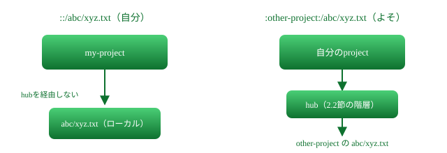
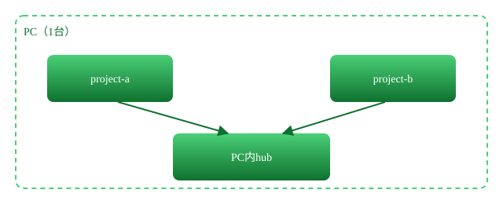
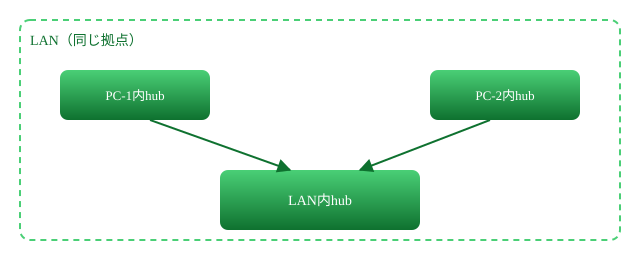
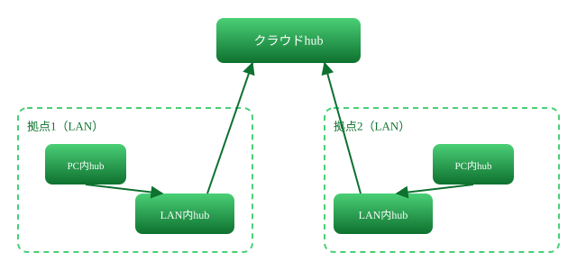
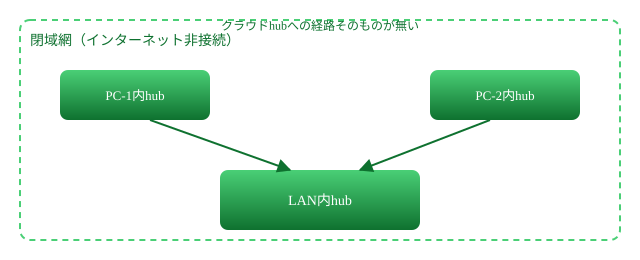

# リソース抽象化構想

プロジェクト間の参照（ファイル・チャット・チケット）を、環境を問わない記法とhub解決で統一する

> 📅 作成: 2026-09-23 / 更新: 2026-09-24

[⌂](../../README.md)

## 1. 背景と目的

[全体構想とMVP計画](p260919-01-全体構想.md)で決めた project_id・instance_id・hub の仕組みを、ファイル参照とチャット・チケットの参照にも広げる。

### 1.1 いま抱えている環境の多様さ

- ツールは `ai-agent-tools`・`ai-chat-lite`・`PlayWright` を既に運用中。`ai-agent-manager`（Claude Code等のエージェントを起動・終了するツール）を構想中
- 場所は家・会社、OSはWindows/Mac/Linuxと多様。ツール・ルールをまたいで共有したい
- ネットワークは閉域網（インターネット非接続のLAN）とインターネット接続環境の両方があり得る
- チャット・チケット管理は、閉域網では Mattermost・Redmine・GitLab、インターネット接続環境では GitHub のように、**置かれた環境によって実体のサービスが変わる**

### 1.2 解きたい問題

「よそのプロジェクトの何かを参照する」ときの書き方が、環境ごとにバラバラになってしまう。ローカルなら絶対パス、LANならUNCパスやIP、クラウドならURL、チャットならMattermostかai-chat-liteか、チケットならRedmineかGitHubか。**参照する側のコード・コマンドが、置かれた環境を意識しなくて済むようにする**のが狙い。

> [!NOTE]
> <strong>今回決めたのはMVP後の設計方針。</strong>実装はMVP（認証・セキュリティ基盤）の後、ロードマップに新しいフェーズとして積む。今回はまだコードを書かない。

## 2. 設計方針

### 2.1 参照記法: 「自分」と「よそ」で書き分ける

ai-chat-lite が使っている「コロンで囲んだID」を、チャットの参加者IDだけでなく、**その先にパスを続けられるリソース参照の記法**として拡張する。ただし参照先が「自分のプロジェクト」か「よそのプロジェクト」かで、記法と解決の仕方を分ける。

```text
::/abc/xyz.txt                          自分のプロジェクトルートを起点（hubに聞かない）
:other-project:/notes/40_issues/issues.html   よそのプロジェクト（hubに問い合わせる）
```

| 記法 | 指す先 | 解決方法 |
|---|---|---|
| `::/path` | 自分のプロジェクトルートからの相対パス | **hubに聞かず、ローカルだけで解決する**。従来の `X:/my-project/abc/xyz.txt`・`C:/work/my-project/abc/xyz.txt` のように置き場所（ドライブ・subst・実体パス）ごとに書き分けていたものを、`::/abc/xyz.txt` の1通りに統一する |
| `:project-id:/path` | よそのプロジェクトのリソース（file/chat/ticket） | hubに問い合わせて解決する（2.2節） |

> [!NOTE]
> **chrootのように閉じ込める。**`::` は自分のプロジェクトルートを起点にし、そこから上には出られない。`::/../secret` のように `..` でルートの外へ出ようとする参照は、解決する側が正規化した時点で拒否する。**「自分の外」を指したくなったら `::` ではなく `:project-id:` を使う**、という書き分けそのものが、意図しない越境アクセスへの歯止めになる。

「自分のプロジェクトルート」がどこかは、実行中のプロジェクトフォルダ（カレントディレクトリから上へ辿って見つかる、そのプロジェクトを示す目印）から、ツールがローカルに判定する。hubを含め、ネットワークには一切問い合わせない。閉域網は元より、hubそのものが落ちていても `::` は解決できる。

#### 2.1.1 短縮形 `./path`

`::/path` はよく使うため、`./path` を同じ意味の短縮形として受け付ける。

```text
./abc/xyz.txt   ==  ::/abc/xyz.txt   （自分のプロジェクトルート起点）
```

> [!NOTE]
> <strong>OSの「カレントディレクトリ」とは意味が違う。</strong>シェルや一般のツールでは `.` は実行中のカレントディレクトリを指すが、ここでの `./path` は**カレントディレクトリに関係なく、常にプロジェクトルートを起点にする**。プロジェクトのサブフォルダで実行していても、`./abc` はそのサブフォルダ配下ではなくプロジェクトルート直下の `abc` を指す。`text`ファミリー（2.8節）などこの記法を解釈するツールの中でだけ通用する約束であり、OS標準のコマンドには影響しない。

#### 2.1.2 行範囲の指定 `#L1-20`

GitLab・GitHubがWeb画面で使っている「ファイル名の後ろに `#L1-20` を付けて行範囲を指す」書き方を、そのまま踏襲する。

```text
::/README.html#L10          10行目だけ
::/README.html#L10-20       10〜20行目
:other-project:/README.html#L1-5   よそのプロジェクトでも同じ書き方
```

> [!NOTE]
> **コマンドラインでは必ずクォートする。**`#`はPowerShellではクォートしない限りコメントの開始と解釈される。`text`ファミリー（2.8節）でこの書き方を渡すときは、ダブルクォートで全体を囲む（「CLIの引数はダブルクォートで囲む」に従う）。ドキュメント中の地の文やチャットの発言では、この制約は関係ない。



`::` は自分のプロジェクトルートを起点にローカルだけで解決し、`:project-id:` はhubを経由してよそのプロジェクトへ届く。書き分けそのものが「hubを経由するかどうか」の目印になる。

### 2.2 解決の仕組み: 階層状に並んだhubだけを参照先にする

hubは1つではなく、置き場所ごとに3段の階層を作る。**それぞれの段がhubであることは変わらず、参照先がhubだけである原則（ローカルキャッシュを持たない）も変わらない**。段が増えるのは、どのhubが答えを知っているかが置き場所によって違うため。

| 段 | 役割 | 知っている範囲 |
|---|---|---|
| PC内hub | そのPC上で動く複数プロジェクト・複数instance用 | 同じPC内のproject_idだけ |
| LAN内hub | 同じ拠点（局所グループ）用 | そのLANに参加している各PCのproject_id |
| クラウドhub | 拠点をまたぐ全体用 | すべてのLAN・PCから登録された、拠点をまたいで参照したいproject_id |

```text
:project-id: を見たツールは、まず自分のPC内hubに問い合わせる
  → PC内hubが知っていれば、そこで解決が終わる
  → 知らなければ、PC内hubがLAN内hubへ問い合わせを引き継ぐ
  → LAN内hubも知らなければ、クラウドhubへ問い合わせを引き継ぐ
  → どの段も知らなければ「解決できない」と返す
```

> [!NOTE]
> **ローカルキャッシュは持たない。**「解決先がhubだけ」という原則は階層になっても変わらない。上位のhubへ引き継ぐのは問い合わせの中継であって、下位が上位の答えを覚えておく仕組みではない。単純さと引き換えに、途中の段が落ちていればそこから先は解決できない。閉域網ではクラウドhubに引き継ぐ段そのものが無い（PC内hub・LAN内hubだけで完結する）ため、1章の「ネット接続に依存しない」原則とも矛盾しない。

#### 2.2.1 4つの場合分け

##### a. 同一PC内だけで完結する場合



同じPC上の複数プロジェクトが、PC内hubだけで `:project-id:` を解決する。LAN・クラウドへは問い合わせを引き継がない。

##### b. LAN内（局所グループ）にまたがる場合



PC-1が知らない `:project-id:` を、PC内hubがLAN内hubへ問い合わせる。LAN内で完結し、クラウドへは出ない。

##### c. クラウドを介して拠点をまたぐ場合



拠点1のLAN内hubも知らない場合だけ、クラウドhubへ問い合わせを引き継ぐ。拠点をまたいだ参照はここで初めて解決する。

##### d. 閉域網（インターネット非接続）の場合



見た目はbと同じだが、**クラウドhubへ引き継ぐ経路自体が存在しない**。LAN内hubが知らなければ、そこで「解決できない」となる。外部の認証局・SaaS・DNSに頼らない前提（全体構想1.3節）と合っている。

### 2.3 既存の番号体系を汎用IDとして引き継ぐ

「ファイル名」ルールが持つ `xYYMMDD-NN`（種別1文字＋日付＋36進数2桁）を、ファイル名だけでなく、**プロジェクトをまたいで参照し合える汎用ID**として引き継ぐ。

| x | 種別 | 備考 |
|---|---|---|
| `p` | plan（計画） | 既存のまま |
| `r` | research（調査） | 既存のまま |
| `q` | quality assurance（品質レビュー） | 既存のまま |
| `i` | issue（課題） | 既存のまま |
| `m` | message（チャットの発言） | 新設。ai-chat-liteの `msg_seq`（例: `#921`）を、日付入りの恒久的なIDに焼き直す |
| `t` | test（テスト） | 新設 |

> [!NOTE]
> **これは共通ルールの変更を伴う。**`m`（message）・`t`（test）の新設は、「ファイル名」節の種別一覧への追記になる。**この場に文言を提示して確認を得てから、「反映して」の指示で共通ルールへ書き込む**（ルールの更新タイミングに従う）。本書ではまず、この番号体系をプロジェクトをまたいだ参照にどう使うかの設計だけを進める。

#### 2.3.1 プロジェクトをまたいだ参照

2.1節の記法にそのまま乗せる。IDの前に何も付かなければ自分のプロジェクト内、`:project-id:` を前に置けばよそのプロジェクトのIDを指す。

```text
i260923-01                     自分のプロジェクトの課題（従来通り、接頭辞なし）
:other-project:i260923-02      よそのプロジェクトの課題
:other-project:m260923-01      よそのプロジェクトのチャット発言（日付入りIDに焼き直したもの）
```

`::i260923-01` という書き方も文法上は成立するが、自分のプロジェクト内なら接頭辞なしの `i260923-01` で足りるため、通常は使わない。

#### 2.3.2 依存・親子関係

課題（`i`）同士は、プロジェクトをまたいでも「依存」「親子」の関係を持てるようにする。参照先は2.3.1のID（自分／よその両方）をそのまま使う。

| 関係 | 書き方の例 |
|---|---|
| 依存（このIDが片付くまで着手できない） | depends-on: `:other-project:i260910-04` |
| 親子（このIDはあるIDの一部） | parent: `i260920-01` |

> [!NOTE]
> **データモデルの詳細は本書の対象外。**「7. チケットアダプタ」フェーズの計画時に、issues.html側の表現方法（HTMLにどう埋め込むか）とhub側の保持方法を詰める。ここでは「プロジェクトをまたいだ依存・親子を持てる」という要件だけを残す。

### 2.4 リソースの種類とバックエンド

hub が project_id ごとに持つレコードは、リソースの種類（file・chat・ticket）ごとに「どのbackendの、どこにあるか」を1件持つ。

| 種類 | backendの例 | 「どこ」の中身 |
|---|---|---|
| file | ローカルディスク／LAN共有／クラウドストレージ | 絶対パス、UNCパス、または取得用のURL |
| chat | ai-chat-lite（ローカル）／Mattermost（閉域網）／クラウドのチャット | 接続先（ポート・URL）とルームID |
| ticket | issues.html（ローカル）／Redmine・GitLab（閉域網）／GitHub（インターネット） | APIエンドポイントまたはファイルパス、プロジェクト識別子 |

ツール側（`text read` 相当のもの、`aichat`、チケットクライアント）は、hubから返った種類・backend名を見て、対応するアダプタ（file/chat/ticket それぞれの実装）に処理を渡す。**アダプタを増やせばbackendを増やせる**構造にし、Mattermost・Redmine・GitLab・GitHubへの対応はそれぞれ個別のアダプタとして後から積む。

#### 2.4.1 chatとticketは別系統のまま、相互参照だけ結ぶ

chatとticketを1つのシステムに統合はしない（backendが違いすぎるため）。その代わり、**2.3節のID体系（`m`・`i`）を共通の橋にして、互いを参照し合えるようにする**。

```text
チャットの発言中に i260923-01 と書けば、その課題を指す
課題（issues.html）の本文中に m260923-05 と書けば、その発言を指す
```

アダプタ側は、本文中に現れた `xYYMMDD-NN` 形式の文字列を認識し、対応する種類（`m`ならchat、`i`ならticket）へのリンクとして扱う。統合されたデータベースを作るのではなく、**互いのIDを本文に書けば、表示側がリンクとして解釈する**という緩い結びつけにする。

#### 2.4.2 Web表示があれば、参照結果にリンクを添える

`text read`（2.8節）などでリソースを取得したとき、そのbackendにWeb版（GitHub Pages・GitHubのファイル表示・チャットのWeb UI等）があるなら、**取得した内容とあわせてWeb版のURLも返す**。人が結果を見て、そのままブラウザで開けるようにするため。

| 種類 | Web版の例 |
|---|---|
| file | GitHub上のファイル表示URL（該当ブランチ・パス） |
| chat | ai-chat-liteやMattermostのWeb UIで、その発言を直接指すURL（あれば） |
| ticket | GitHub Issues・Redmine・GitLabのチケット画面URL |

> [!NOTE]
> <strong>Web版が無いbackendもある。</strong>ローカルファイル・ローカルのissues.htmlのようにWeb版を持たない場合は、URLを付けずに内容だけ返す。「あれば添える」であり、無いことを異常とはしない。

### 2.5 ai-agent-manager との関係

構想中の `ai-agent-manager`（エージェントの起動・終了ツール）も、project_id からその実体（ローカルパスなど）を知る必要がある点で、file リソース解決の利用者の1つになる。**ai-agent-manager 自体の設計は本書の対象外**とし、リソース抽象化の消費者として名前だけ触れる。

### 2.6 同一 project_id が複数PCに存在する場合

`ai-agent-tools`・`PlayWright` のような共有ツールは、各PCにコピーを置いて使う。開発する場所は通常1箇所に決まるが、git・GitHub（GitLab）を使えば複数拠点で並行して開発することもあり得る。**project_id をhubへ登録する時点で、この曖昧さに向き合う必要がある**。

#### 2.6.1 既定: 申請制（先着順登録）

project_id は hub のスコープ内で一意に保つ。**先に登録した側が正規（canonical）になり、後から同じ project_id を登録しようとすると拒否される**。拒否された側は、それが誤りなのか、それとも意図した並行開発なのかを人が判断する。

#### 2.6.2 特殊: 複数拠点での並行開発

意図して同じプロジェクトを複数拠点で並行開発する場合だけ、`project-id/site-id` の形で明示的に区別して登録する。`@`はチャットの宛先指定（`@project-id`）と重複するため使わない。

```text
:ai-agent-tools:                  既定では、登録済みの正規（canonical）1件に解決される
:ai-agent-tools/home-pc:          home-pc拠点の版を名指しする
:ai-agent-tools/office-pc:        office-pc拠点の版を名指しする
:ai-agent-tools/home-pc:/README.html   site指定とリソースパスを両方書いた例
```

> [!NOTE]
> **区切りは、閉じる `:` の位置で決まる。** `site-id` は閉じコロンより内側、リソースパスは閉じコロンより外側の `/path` になる。`/` を2箇所で使うため人の目には詰まって見えるが、閉じコロンがある限り機械的には曖昧にならない。

> [!NOTE]
> <strong>`/site-id` は常には付けない。</strong>並行開発が要らない大多数のプロジェクトでは、`:project-id:` だけで済む。site識別子は「特殊な場合の逃げ道」であり、既定の書式を複雑にしない。

### 2.7 認証・認可

[全体構想](p260919-01-全体構想.md)のMVPが発行するトークン（instance_id・project_idを含む）を、そのまま認証（このリクエストは誰から来たか）の土台として使う。ここで新しく詰めるのは、<strong>認可（そのリクエストを許してよいか）</strong>の方である。

#### 2.7.1 アクセスの方向

すべてのリソースアクセスを「requester（要求する側のinstance/project）→ target（リソースを持つ側のproject）」の1方向として扱う。targetが許可しない限り、requesterは何も取得できない（既定拒否）。

#### 2.7.2 トークンの中身と有効期限

| 項目 | 内容 |
|---|---|
| requester | instance_id・project_id・agent_type（全体構想2.2〜2.3節のもの） |
| scope | 対象のtarget project_id、リソース種別（file/chat/ticket）、権限レベル（read/write） |
| 有効期限 | 短命（分〜時間の単位）。切れたら再度チャレンジ・レスポンスからやり直す |

トークンは「targetのリソースに対する、この権限だけ」に絞って発行する。requesterのidentity用トークン（全体構想3.3節の`tokens`）とは別に、**アクセスのたびに、その場限りのscope付きトークンを発行し直す**形にする。

#### 2.7.3 誰が許可するか: project単位のACL＋所有者userの一括許可

認可の主体は**project単位**とする。各targetプロジェクトは、自分のリソースについて「どのproject_idに、どの権限を許すか」という許可リストをhubに登録する。既定は拒否で、リストに無いrequesterは通さない。

これとは別に、**「所有者user」という概念を新設する**。projectは1人の所有者user（人間）に紐づき、user は複数のprojectを所有できる。**同じuserが所有するprojectどうしは、ACLに個別登録しなくても一括で許可される**。他人が所有するprojectへのアクセスは、targetのACLに明示登録された場合だけ許される。

| ケース | 判定 |
|---|---|
| requesterとtargetの所有者userが同じ | ACL登録が無くても許可（一括許可） |
| requesterとtargetの所有者userが違う | targetのACLに明示登録されている場合だけ許可 |

> [!NOTE]
> <strong>1人が多くのprojectを持つ、いまの実態に合わせた既定。</strong>同一人物が運営する複数プロジェクト間の連携（例: このai-agent-support自身とai-chat-lite）では、いちいちACLを書かずに済む。複数人・複数組織にまたがる連携が要る場面だけ、targetプロジェクト側でACLを明示する。

#### 2.7.4 group: userとprojectをまとめる単位

1件ずつのACL登録・1人だけの所有者では足りない場面がある。**複数人のチームが共同でプロジェクトを所有する**、**複数プロジェクトへまとめて権限を与えたい**といったケースのため、`group`を新設する。

| 使い方 | 内容 |
|---|---|
| 所有者をgroupにする | projectの所有者を単一userではなくgroupにできる。groupに属するuserは誰でも、そのprojectを「自分の所有物」として一括許可の対象にできる（2.7.3の判定基準が「同じuser」から「同じgroupに属する」に拡張される） |
| ACLの許可先をgroupにする | ACLの`allowed`にproject_idだけでなくgroup_idも指定できる。1件のACL登録で、そのgroupに属する全projectへ許可が及ぶ |

> [!NOTE]
> **groupはuserとprojectの両方を束ねられる。**「このチームのuser全員」「この一式のproject全部」のどちらも同じgroupの仕組みで表す。個別登録（project単位）・一括登録（所有者user単位）・チーム単位（group）の3段階を用意することになる。

#### 2.7.5 データモデルへの追加

| テーブル | 追加する列 |
|---|---|
| identities（全体構想3.3節） | owner_ref（所有者。user_idまたはgroup_idのどちらか） |
| acl（新設） | target_project_id, allowed_ref（project_idまたはgroup_id）, resource_type, permission, granted_at |
| groups（新設） | group_id, name |
| group_members（新設） | group_id, member_ref（user_idまたはproject_id） |

### 2.8 想定するCLI: `text` ファミリー

2.1〜2.4節の記法・解決の仕組みを、実際に使うための道具を用意する。既存の `text`（ai-agent-tools。read/find/edit/write の4つ）を置き換える想定なので、**引数の渡し方は既存の `text` にそのまま揃え**、`::`・`:project-id:` の両方を受け付けられるように対象だけを広げる。読む（`read`）と探す（`find`）は既存どおり別コマンドのままにし、`read`に検索を統合しない。

```powershell
text list ::/notes                                 # 自分のプロジェクト配下を一覧（新設。ls相当）
text list :other-project:/notes --find "計画"       # よそのプロジェクトを絞り込んで一覧
text read ::/README.html                           # 自分のファイルを読む（既存read相当）
text read ::/README.html --lines 3-5               # 行範囲を指定して読む（既存read相当）
text read "::/README.html#L10-20"                  # GitLab/GitHub風の行範囲アンカーでも同じ意味
text read :other-project:/notes/40_issues/issues.html
text find "計画" ::/notes --recurse                 # 自分のプロジェクト配下を探す（既存find相当）
text find "計画" :other-project:/notes --recurse --regex --invert   # 正規表現・不一致行（新設）
text write ::/tmp/out.txt --in tmp/body.txt        # 新規作成・上書き（既存write相当。第2引数／標準入力も可）
text edit :other-project:/README.html --old "旧" --new "新"   # 置換（既存edit相当）
text edit ::/README.html --lines 3-3 --digest 9f2a1c33 --new "..."   # 行範囲＋合言葉（既存edit相当）
```

| コマンド | 対応する既存操作 | 備考 |
|---|---|---|
| `text list` | （新設。既存textには無い） | `ls` / `Get-ChildItem`相当。`--find` で絞り込み、`--recurse` で再帰 |
| `text read` | 既存の `text read`（そのまま） | 行範囲は既存どおり `--lines`。加えて`#L1-20`アンカー（2.1.2節）も同じ意味として受け付ける。検索は行わない（`find`に分離したまま） |
| `text find` | 既存の `text find`（そのまま） | `--recurse`・`--include`は既存どおり。`--regex`（正規表現＝egrep相当）・`--invert`（不一致行＝egrep -v相当）は新設の拡張 |
| `text write` | 既存の `text write`（そのまま） | 中身は既存どおり `--in <path>`・第2引数・標準入力のいずれかで渡す。`--content`のような新しい渡し方は増やさない |
| `text edit` | 既存の `text edit`（そのまま） | `--old`/`--new`（中身で指す）または`--lines`+`--digest`+`--new`（行範囲＋合言葉）は既存どおり。`--regex`を付けると`--old`を正規表現として扱う（新設の拡張） |

> [!NOTE]
> <strong>正規表現の方言は1つに決める。</strong>PowerShell・.NET・JavaScriptなど、正規表現の書き方は処理系によって微妙に違う。`--regex`がどの方言を指すかは、実装フェーズの計画時に決める（本書では「対応が要る」ことだけを残す）。

> [!NOTE]
> <strong>write・editは書き込み権限が要る。</strong>2.7節のACLで `permission: write` を持たない相手には拒否する。readより一段厳しく扱う。

> [!IMPORTANT]
> <strong>既存の `text`（ai-agent-tools）との関係。</strong>ai-agent-toolsは既にローカルのSJIS安全な読み書き用として`text read`・`text find`・`text edit`・`text write`を持っている。本書の`text`ファミリーは**これを置き換える想定**であり、共存を前提にした別名づけはしない。既存コマンドの引数の渡し方（上表）はそのまま踏襲し、`::`・`:project-id:`を受け付けられるように対象だけを広げる。同名のコマンドをPATH上に2つ並べたまま並行運用すると、先勝ち解決でどちらが動いたか区別できなくなる問題が既に他プロジェクトの移行（check-contrastの移行、i260924-05参照）で実際に起きているため、置き換えが完了するまでの間はai-agent-tools側の実装を残さない（両方を同時にPATHへ置かない）。実装をどちらのプロジェクトに置くか、置き換えの手順・移行期間の扱いは、このフェーズの計画時にai-agent-tools側と調整する（他プロジェクトのファイルは直さない原則に従う）。

## 3. ロードマップとの関係

[全体構想](p260919-01-全体構想.md)のロードマップにあった「5. 外部連携（Mattermost）」「6. チケット管理」は、本構想の **アダプタ** として位置づけ直す。全体構想の該当箇所は本書へのリンク参照に更新済み（本書のこの表が正）。

| 順番 | フェーズ | 内容 |
|---:|---|---|
| 1〜4 | （全体構想のまま） | 認証基盤 → メッセージング → ファイル受け渡し → LAN/クラウド対応 |
| 5 | リソース抽象化基盤 | 本書の内容。`:project-id:/path` の解決をhubに実装し、file アダプタ（ローカル/LAN/クラウド）をまず1つ用意する |
| 6 | チャットアダプタ | ai-chat-lite（既存）・Mattermost・クラウドチャットのアダプタを順に足す |
| 7 | チケットアダプタ | issues.html（既存）・Redmine・GitLab・GitHubのアダプタを順に足す |

> [!NOTE]
> <strong>今回はここまで。</strong>実装に入る前に、各アダプタのフェーズごとに個別の計画書を立てる（「機能を追加・変更するときの順序」に従う）。

[⌂](../../README.md)
